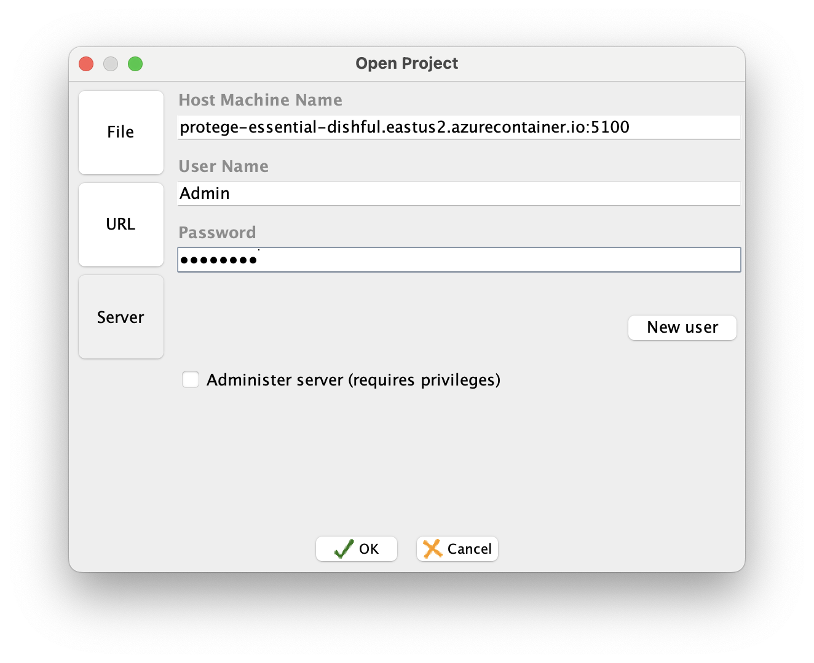

# EssentialOpen
This repository contains a set of scripts designed to run the open-source release of the Essential Project.

The scripts are built to containerize the application using Docker and deploy it to Azure.

The solution is fully functional, with authentication integrated through Entra ID / Active Directory, providing a secure and scalable environment for enterprise architecture management.

These scripts automate the setup, containerization, and deployment processes, ensuring a smooth transition from local development to cloud deployment.

# Getting Started

To begin setting up the Essential Open Source EA Tool, follow these steps:

1. Clone the repository:

    ```bash
    git clone git@github.com:terryvel/EssentialOpen.git
    ```

2. Navigate to the project directory:

    ```bash
    cd EssentialOpen
    ```

3. Prepare the environment for Docker image build:

    ```bash
    sh scripts/1_prepare.sh
    ```
Here is an example of how the script should finish executing.


Save the password shown in the script, **PUBLISH_PASSWORD**. You will need it to publish changes to "Essential Viewer" using Protégé.

4. Now you can run the project locally with Docker:

    ```bash
    docker compose up
    ```

You can access Essential Viewer at http://localhost:9090.


# Download and use Essential Protégé Ontology Editor

The platform for capturing the architecture model can be downloaded from one of the links below according to your operating system[^1]:

- [Windows-64 Install with JVM](https://cdn.enterprise-architecture.org/protege/install_protege_3.5-Win64-JVM.exe)
- [MacOS Install](https://cdn.enterprise-architecture.org/protege/Protege_macOS.zip)
- [Linux-64 Install with JVM](https://cdn.enterprise-architecture.org/protege/install_protege_3.5-Linux64-JVM.bin)
- [Linux-64 Install without JVM](https://cdn.enterprise-architecture.org/protege/install_protege_3.5-Linux64-noJVM.bin)
- [Unix Install](https://cdn.enterprise-architecture.org/protege/install_protege_3.5-Unix-Any.bin)

[^1]: [Download | The Essential Project](https://enterprise-architecture.org/products/essential-open-source/essential-os-download/).

In my case, since I use macOS, I run Protégé with the command:

    ```bash
    cd Protege
    ./run_protege.sh
    ```

On the Welcome screen, you must choose the option "Open other".


Then you choose the "Server" option by filling in the fields:

**Host Machine Name:** localhost:5100
**User Name:** Admin
**Password:** 11223344


Select the "Essential AM" project and click "OK"


Voilà, there is your repository, you can make modifications and try out Essential locally.


You can submit your changes to Essential Viewer using the Essential Viewer tab with the username "publisher" and the password provided at the end of the `1-prepare.sh` script.

**Essential Viewer:** http://localhost:9090/essential_viewer
**User Name:** publisher


# Deploy on Azure

This step-by-step guide deploys the solution on Azure, and if you want to try it out you can still use Azure for free with $200 Free Credit.[^2]

Using the Azure subscription, we will configure authentication based on Entra ID, formerly Azure AD, so that only authenticated users can access Essential Viewer. This example is easily adjusted to use a corporate AD.

[^2]: [Enjoy $200 Free Credit](https://azure.microsoft.com/en-us/free/).

## Set resources names
To define the resource names, run the `2_resources_names.sh` script.
It must be run with the source command, as it will create some environment variables that will be used in the next scripts.

    ```bash
    source scripts/2_resources_names.sh
    ```

Here is an example of how the script should finish executing.


## Publish Essential Viewer to Azure

To create Essential Viewer resources in Azure, run the script `3_deploy_ssential_viewer.sh`.
This script stores a log of the commands successfully executed in case you need to run it more than once (execution.log).

I had some problems with the eastus region, due to lack of quota, so I had to change to eastus2.

    ```bash
    sh scripts/3_deploy_ssential_viewer.sh
    ```

Here is an example of the message that the script will display.


If everything goes well, at the end of the script you will have deployed all the resources necessary for Essential Viewer to work and now you just need to send the folder with the Essential Viewer files.
To do this, we will use the script `4_copy_essential_viewer_files.sh`.

    ```bash
    sh scripts/4_copy_essential_viewer_files.sh
    ```

Now, everything is ready! Just authenticate and enjoy the Essential Viewer.

This workaround for authentication was done with oauth2-proxy[^3] using Azure, but it supports several other Providers, and the modification to use another provider can be easily done by changing the WebApp's environment variables.

[^3]: [OAuth2 Proxy](https://oauth2-proxy.github.io/oauth2-proxy/).


## Publish Protégé Server to Azure

To create Protégé Server resources in Azure, run the script `5_deploy_protege.sh.sh`.

    ```bash
    sh scripts/5_deploy_protege.sh.sh
    ```

Here is an example of the message that the script will display.


If everything goes well, you now have the Protégé Server running on a Container Instance in Azure.

You can monitor the Server logs with the command:

    ```bash
    az container attach --resource-group $RESOURCE_GROUP --name $CONTAINER_REGISTRY
    ```

If you are going to run the command `2_resources_names.sh` in another terminal, remember to run the script with the codename you are using.
Example:

    ```bash
    source scripts/2_resources_names.sh --codename essential-dishful
    ```

You can also get a shell in ACI with the command:

    ```bash
    az container exec --resource-group $RESOURCE_GROUP --name $CONTAINER_REGISTRY --exec-command bash
    ```

Useful for debugging and trying to solve problems.

Well, in my case, I can access the Protégé Server through the address:
`protege-essential-dishful.eastus2.azurecontainer.io`.



In practice, it is taking a long time to load... more than 5 minutes, I still haven't been able to understand why.

I found this page **Very slow project load in Protege client from Protege**[^4] on the internet and will read it later to see if I can find anything.

If anyone has an idea, please share it! ;)

[^4]: [Very slow project load in Protege client from Protege](https://protege-discussion.stanford.narkive.com/rnFsFauX/very-slow-project-load-in-protege-client-from-protege-server).

# That's it
I hope these steps help as many people as possible to test Essential, a great tool, and that these tests help you convince your board to invest in an EA tool (preferably Essential).

I would like to express my sincere gratitude to **Urbiwanus** for his work on the [essential-project-docker](https://github.com/Urbiwanus/essential-project-docker) repository. His project served as a significant reference and inspiration for me to get started with this setup. Without his contributions, this journey would have been much more challenging. Thank you, Urbiwanus!